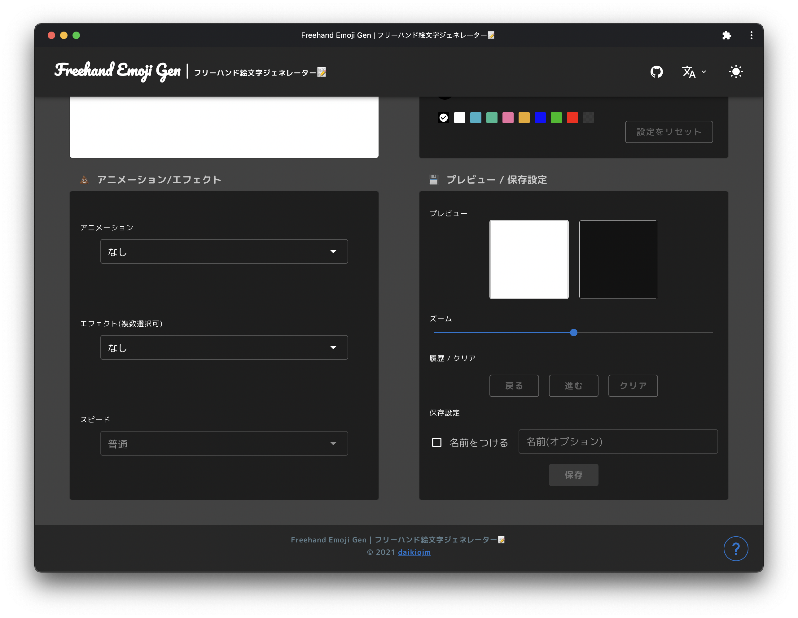

# freehand-emoji-gen

[](https://github.com/daikiojm/freehand-emoji-gen/actions/workflows/gh-pages.yml)

Development repository for `Freehand Emoji Generator 📝` that create custom emoji for use in Slack, Discord, and other chats.



https://daikiojm.github.io/freehand-emoji-gen/

## ⚙️ Setup

```bash
# install dependencies
$ yarn install

# serve with hot reload at localhost:3000
$ yarn dev
```

## 🎯 Features

- Freehand input & Style setting change
- Real-time preview
- Animations and Effects
- `png` and `gif` output
- Keyboard Shortcuts

## 🏛 Libraries

- [perfect-freehand](https://github.com/steveruizok/perfect-freehand) - Freehand Path Strokes 
- [PixiJS](https://github.com/pixijs/pixijs) - Animations and Effects
- [and more](package.json) 

## 🧘‍♂️ Inspirations

- [Emoji Generator](https://github.com/emoji-gen/web-main)
- [MEGAMOJI](https://github.com/zk-phi/MEGAMOJI)

## ‎‍💻 Contributing

First of all, thank you so much for wanting to contribute to the project!  
Please opening issues or creating pull requests.
