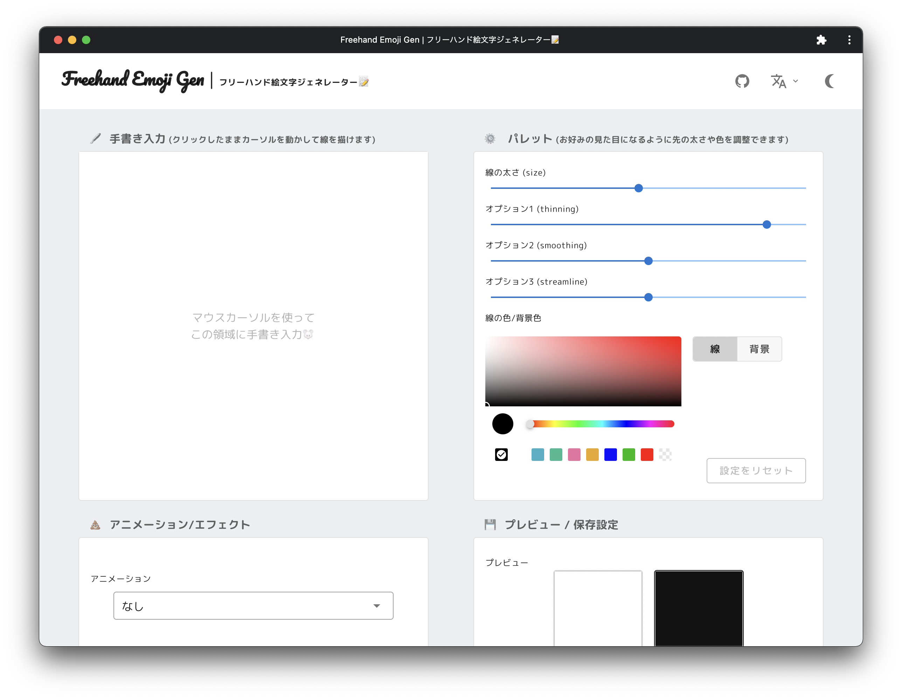

# freehand-emoji-gen

[](https://github.com/daikiojm/freehand-emoji-gen/actions/workflows/gh-pages.yml)



https://daikiojm.github.io/freehand-emoji-gen/


## Build Setup

```bash
# install dependencies
$ yarn install

# serve with hot reload at localhost:3000
$ yarn dev

# build for production and launch server
$ yarn build
$ yarn start

# generate static project
$ yarn generate
```

For detailed explanation on how things work, check out [Nuxt.js docs](https://nuxtjs.org).
